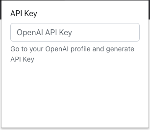

# Gmail Email Assistant Chrome Extension

The Gmail Email Assistant Chrome Extension enhances your Gmail experience by integrating OpenAI's language generation capabilities. With this extension, you can easily generate email replies and continue composing emails using AI-generated text.

## Installation

1. Download or clone this repository to your local machine.
2. Open a terminal and navigate to the extension directory.
3. Install the required dependencies by running the following command:
   ```bash
   npm install
   ``````
4. Build the extension by running the following command:
    ```bash
    npm run build
      ```
5. Open Google Chrome and navigate to `chrome://extensions/`.
6. Enable "Developer mode" by toggling the switch in the top right corner.
7. Click on the "Load unpacked" button and select the directory where you downloaded the extension files.
8. The AI Email Replier extension is now added to your Chrome browser.

## Usage

1. Click on the Gmail Email Assistant icon in the Chrome toolbar to open the popup window.
2. In the popup window, enter your OpenAI API key in the provided input field. Don't have an API key? Follow the instructions provided to generate one.
3. Open a new email composition window in Gmail.
4. A new "Email Assistant" button will appear in the email composition interface.
5. Click the "Email Assistant" button to generate AI-assisted text for your email reply or continue composing an email.

### Clicking on extension
You should be able to provide your OpenAI API Key. The extension utilizes Chrome's local storage to retain this input even when the extension is closed.

### Composing New Email

### Replying to Email


## Configuration

- You can modify the behavior of the OpenAI language generation by adjusting parameters in the code.
- To change the AI model used for text generation, update the `model` variable in the `openaiParameters` object.
- Additional configuration options can be found in the OpenAI API documentation.

## Dependencies

- The extension relies on the OpenAI API for language generation. Make sure you have a valid OpenAI API key.
- This extension uses the `sse.js` library for Server-Sent Events communication.

## Troubleshooting

If you encounter any issues while using the extension, try the following steps:

1. Double-check your OpenAI API key and ensure it is correctly entered in the extension popup.

## Contributing

Contributions to this extension are welcome! Feel free to fork this repository, make improvements, and submit pull requests.


## Contact

If you have any questions, suggestions, or encounter issues, please feel free to contact the project maintainer at [edwinjmenendez@gmail.com](mailto:your@email.com).
